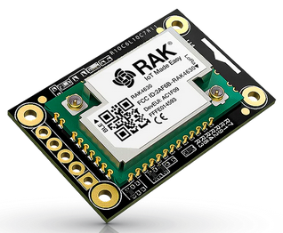

# RAK11300 AT Command Firmware

| <center></center>  | <center></center> | <center></center> | <center></center>  | <center></center>  |
| -- | -- | -- | -- | -- |

----

This project is a quick start for the [RAKwireless WisBlock RAK4631 LPWAN module](https://docs.rakwireless.com/Product-Categories/WisBlock/). It gives the opportunity to test the LPWAN functionality without writing and flashing code.    
It is a very simple firmware that provides an AT Command Interface over USB or BLE UART of the module. It is not optimized for low power consumption.

----

The LPWAN credentials are stored in the flash memory of the RAK4631 LPWAN module. The firmware is written using the Arduino framework, the source code is provided for both Arduino IDE and for [PlatformIO](https://platformio.org/). It uses the [Nordic nRF52 boards package](https://docs.platformio.org/en/latest//boards/index.html#nordic-nrf52) which needs to be patched with the [RAK_Patch](https://github.com/RAKWireless/WisBlock/tree/master/PlatformIO) to support the RAK4631. 

----

All AT commands are listed and explained in the [AT-Command Manual](./AT-Command.md). 

## Short example for OTAA connection test:    
Set the DevEUI
```
AT+DEVEUI=5555555553525150
```
Set the AppEUI
```
AT+APPEUI=5051525355555555
```
Set the AppKey
```
AT+APPKEY=55555555535251505051525355555555
```
Set the Region (US915)
```
AT+BAND=8
```
Check the settings
```
AT+STATUS=?
```
Start network join (requires a gateway connected to a LPWAN server and the device registered on the LPWAN server with above credentials)
```
AT+JOIN=1,0,1,1
```

Log output:    
```
============================
WisBlock Node
SW Version 1.0.5
LoRa(R) is a registered trademark or service mark of Semtech Corporation or its affiliates.
LoRaWAN(R) is a licensed mark.
============================
Device status:
   RAK4631
   Auto join enabled
   Mode LPWAN
   Network not joined
   Send Frequency 0
LPWAN status:
   Dev EUI AC1F09FFFE0679DB
   App EUI 70B3D57ED00201E1
   App Key 2B84E0B09B68E5CB42176FE753DCEE79
   Dev Addr 26021FB4
   NWS Key 323D155A000DF335307A16DA0C9DF53F
   Apps Key 3F6A66459D5EDCA63CBC4619CD61A11E
   OTAA enabled
   ADR disabled
   Public Network
   Dutycycle disabled
   Join trials 5
   TX Power 0
   DR 3
   Class 0
   Subband 1
   Fport 2
   Unconfirmed Message
   Region AS923-3
LoRa P2P status:
   P2P frequency 916000000
   P2P TX Power 22
   P2P BW 125
   P2P SF 7
   P2P CR 1
   P2P Preamble length 8
   P2P Symbol Timeout 0
============================

AT+JOIN=1:0:30:10
AT+JOIN=1:0:30:10

OK

AT+JOIN=SUCCESS
```